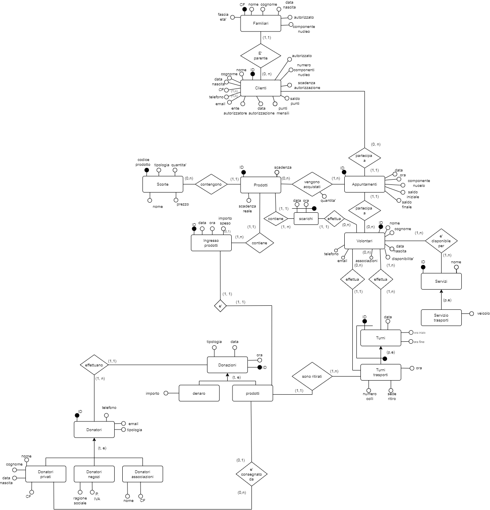
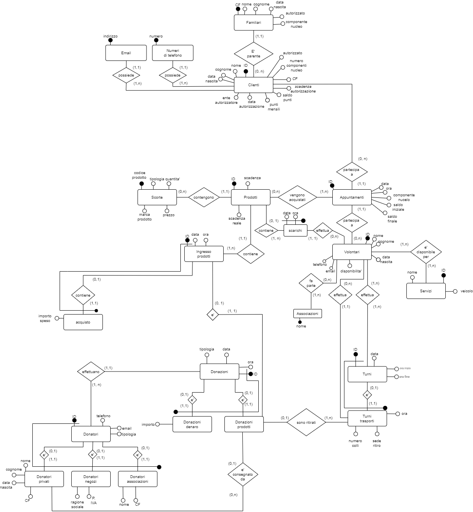

## `Requisiti ristrutturati`

Questa base di dati dovra' svolgere diverse mansioni anche motlo diverse fra di loro, ovvero:

#### `Organizzare i prodotti in inventario`

in modo da avere quanta piu' automazione possibile, quindi, per esempio, sapere quando un prodotto sta per finire, aggiornare in automatico le quantita' di un dato prodotto quando questo viene acquistato da un cliente oppure rifornito tramite donazione o acquisto del market, effettuare lo scarico dei prodotti molto vicini alla data di scadenza e memorizzare ogni ingresso prodotti nel market. Il market puo' inoltre acquistare dei prodotti in autonomia nel caso in cui, per esempio, un dato prodotto non venga donato.

**Per ogni prodotto**, si memorizzano la marca, il prezzo in punti, la data di scadenza (\underline{nel caso di beni deperibili}) e la data di scadenza "reale", ovvero la data (dopo la data di scadenza) in cui un dato prodotto non e' piu' utilizzabile/commestibile.

**Per ogni scorta di prodotti** viene salvata la tiplogia del prodotto (shampoo, tonno, pasta...), la marca (Garnier, Rio Mare, Barilla...) e la relativa quantita' disponibile.

**Per ogni ingresso prodotti** viene salvata la data e l'ora

**Per ogni scarico prodotti** viene salvata la data e l'ora.

\underline{NOTA}: supponiamo che per ogni scarico si definiscano la data e l'ora, ma che il volontario gli venga assegnato in seguito perche', per esempio, lo scarico e' tra un mese.

#### `Gestire i vari appuntamenti con la clientela`

in modo da memorizzare i vari dati di un appuntamento oltre a poter risalire al cliente che vi ha partecipato, al volontario che lo ha supervisioanto a quali prodotti sono stati acquistati. E' inoltre necessario risalire non solo al cliente ma anche al suo nucleo familiare, siccome i suoi componenti possono acquistare i prodotti a nome del cliente stesso (\underline{se autorizzati a spendere i punti}, in genere chi e' sopra i 16 anni d'eta'). Supponiamo che un cliente possa avere piu' contatti (recapiti telefonici e email) e che fornisca lui i recapiti dei familiari, di conseguenza i familiari non dovranno fornire alcun recapito.

**Per ogni appuntamento** si memorizza la data, l'ora, il componente del nucleo familiare che vi prende parte, il saldo iniziale e il saldo finale.

##### `Ricevere le donazioni`

che possono essere in denaro oppure prodotti, forniti da diverse tipolgie di donatori (privati, negozi, associazioni). Nel caso delle donazioni in prodotti, la consegna al market viene effettuata rispettivamente dal privato nel caso appunto di una donazione in prodotti da un privato, e da un volontario se invece la donazione e' fatta da un negozio o associazione. In ogni caso, ogni donazione viene salvata e collegata al suo donatore e nel caso di una donazione in denaro verra' salvato l'importo, mentre per la donazione in prodotti verra' aggiornato l'inventario e verra' salvato l'ingresso prodotti.

**Per ogni donazione** vengono memorizzate la data, l'ora, e, nel caso di una donazione in denaro, l'importo,

**Per ogni donatore** vengono memorizzati i recapiti (numero di telefono e email), univoci per ogni donatore. Nel caso di un donatore privato si salvano inoltre il nome, il cognome, la data di nascita e il codice fiscale. Per i negozi si salva la ragione sociale e la partita IVA e, infine, per le associazioni il nome e il codice fiscale.

#### `Organizzare il lavoro dei volontari`

memorizzando per quali servizi un dato volontario e' disponibile (e in quali giorni/ore) e organizzando i turni anche in base a queste informazioni.

**Per ogni volontario** si salva il nome, il cognome, la data di nascita, le (eventuali) associazioni a cui e' collegato e i recapiti (univoci, email e numero di telefono).

**Per ogni turno** si salva la data, l'ora di inizio e l'ora di fine. Nel caso di un turno di trasporto merci, si salva anche l'ora del trasporto, il numero di colli da trasportare e la sede del ritiro.

**Per ogni servizio** vengono salvati il nome (es. ritiro merci) e, nel caso di un trasporto merci, il tipo di veicolo utilizzato.

## `Progetto concettuale`

\newpage

## `Dizionario entita'`

- `Clienti`

  - **ID**: `int`
    - Numero identificativo (unico per ogni cliente)
  - nome: `string`
  - cognome: `string`
  - data di nascita: `date`
  - codice fiscale: `string`
  - telefono: `string`
    - Numero/i di telefono associati al cliente
  - email: `string`
    - Indirizzo/i email associati al cliente
  - ente_autorizzatore: `string`
    - L'ente che ha concesso l'autorizzazione al cliente
  - data_autorizzazione: `date`
    - data di conseguimento dell'autorizzazione
  - scadenza_autorizzazione: `date`
    - di default dopo 6 mesi dalla data di autorizzazione
  - punti_mensili: `int`
    - saldo mensile che ogni cliente puo' spendere
  - saldo_punti: `int`
    - saldo punti attuale
  - n_componenti_nucleo: `int`
    - il numero dei componenti del nucleo familiare
  - autorizzato: `bool`
    - se il cliente e' autorizzato a spendere i punti oppure no

- `Familiari`

  - **CF**: `string`
    - codice fiscale
  - nome: `string`
  - cognome: `string`
  - data_nascita: `date`
  - componente_nucleo: `string`
    - quale componente del nucleo familiare e' (padre, madre, figlio...)
  - autorizzato: `bool`
    - se e' autorizzato a spendere i punti oppure no
  - fascia eta': `string`
    - fascia d'eta' corrispondente ('0 - 5 anni', '6 - 10 anni'...)

- `Volontari`

  - **ID**: `int`
    - Numero identificativo del volontario (unico per ogni volontario)
  - nome: `string`
  - cognome: `string`
  - data_nascita: `date`
  - telefono: `string`
    - unico per ogni volontario
  - email: `string`
    - unico per ogni volontario
  - disponibilita': `string`
    - fascia oraria e giorni in cui e' disponibile per i servizi (es. il giovedi' dalle 3 alle 5)
  - associazione: `string`
    - l'eventuale associazione/i a cui il volontario e' collegato

- `Fasce orarie`
  - **ID**: `string`
  - giorno: `string`
  - fascia oraria: `string`

- `Prodotti`

  - **ID**: `int`
    - identificativo del singolo prodotto
  - scadenza: `date`
  - scadenza_reale: `date`
    - data oltre il quale e' necessario effettuare lo scarico del prodotto

- `Scarichi`

  - **data**: `date`
  - **ora**: `time`

- `Scorte`
  - **codice_prodotto**: `int`
    - codice identificativo per tutti i prodotti con una data tipologia e marca
  - tipologia: `string`
    - Tipologia generica del prodotto (pasta, tonno...)
  - marca: `string`
    - marca del prodotto (de Cecco, Rio Mare...)
  - prezzo: `float`
    - costo in punti
  - quantita': `int`
    - Quantita' disponibile di un dato prodotto in magazzino

- `Ingresso prodotti`
  - **ID**: `int`
  - data: `date`
  - ora: `time`
  - importo speso: `float`
    - Nel caso di prodotti acquistati dal market, si memorizza anche la spesa sostenuta

- `Servizi`
  - **ID**: `int`
  - nome: `string`
    - nome del servizio (es. riordino prodotti)

- `Servizio -> trasporti`
  - veicolo: `string`
    - tipologia del veicolo usato nel caso di un servizio di trasporti

- `Turni`
  - **ID**: `int`
  - data: `date`
  - ora_inizio: `time`
  - ora_fine: `time`
  
- `Turni -> trasporto`
  - ora: `time`
  - n_colli: `int`
    - Numero di cestelli/scatoloni da ritirare
  - sede_ritiro: `string`

- `Donazioni`
  - **ID**: `int`
  - data: `date`
  - ora: `time`
  - tipologia: `string`
    - "denaro" o "prodotti"

- `Donazioni -> denaro`
  - importo: `float`
    - ammontare della donazione

- `Donazioni -> prodotti`

- `Donatori`
  - **ID**: `int`
  - telefono: `string`
  - email: `string`
  - tipologia: `string`
    - "privato", "negozio" o "associazione"

- `Donatori -> privati`
  - nome: `string`
  - cognome: `string`
  - data_nascita: `date`
  - CF: `string`
    - codice fiscale

- `Donatori -> negozi`
  - ragione_sociale: `string`
  - p_iva: `string`

- `Donatori -> associazioni`
  - nome: `string`
  - CF: `string`
    - codice fiscale

## `vincoli d'integrita'`

- `Familiari`
  - l'autorizzazione a spendere i punti si ha se il componente
    del nucelo familiare ha piu' di 16 anni di eta' (ma puo' comunque essere revocata per qualsiasi motivo)
  - 'CF' e' univoco

- `Clienti`
  - 'ID' e' univoco
  - Ogni cliente puo' avere uno o piu' numeri di telefono
  - Ogni cliente puo' avere uno o piu' indirizzi email
  - il codice fiscale e' univoco
  - la scadenza dell'autorizzazione e' di default 6 mesi dopo la data dell'autorizzazione
  - la data dell'autorizzazione deve essere superiore o uguale alla data dell'inserimento
  - la data di scadenza deve essere maggiore della data di autorizzazione
  - i punti mensili devono essere compresi tra 30 e 60
  - il saldo punti non puo' essere minore di 0
  - il cliente deve essere maggiorenne
  - numero componenti familiari deve essere maggiore di 0

- `Appuntamenti`
  - 'ID e' univoco'
  - data e ora sono univoche insieme
  - 'saldo_iniziale' deve essere maggiore di 0
  - 'saldo_finale' deve essere minore di 'saldo_iniziale'

- `Prodotti`
  - 'ID' e' univoco
  - 'scadenza_reale' deve essere maggiore di 'scadenza'

- `Scorte`
  - 'codice_prodotto' e' univoco
  - quantita' deve essere maggiore o uguale di 0
  - 'prezzo' deve essere maggiore di 0
  - tiplogia e marca devono essere univoci insieme

- `Volontari`
  - 'ID' e' univoco
  - telefono deve essere univoco
  - email deve essere univoca

- `Fasce orarie`
  - giorno e fascia oraria sono unique insieme

- `Turni`
  - 'ID' e' univoco

- `Turni -> trasporti`
  - 'n_colli' deve essere maggiore di 0

- `Servizi`
  - 'ID' e' univoco
  - il nome del servizio e' univoco

- `Servizi -> trasporti`
  
- `Ingresso prodotti`
  - 'ID' e' univoco
  - data e ora devono essere univoche insieme

- `Acquisto`
  - 'importo_speso' deve essere maggiore di 0

- `Donazioni`
  - 'ID' e' univoco
  - data e ora devono essere univoche insieme
  - tipologia deve essere "denaro" oppure "prodotti"

- `Donazioni -> denaro`
  - 'importo' deve essere maggiore di 0

- `Donazioni -> prodotti`
  - se il consegnatario e' un privato non puo' essere un volontario e viceversa

- `Donatori`
  - 'ID' e' univoco
  - telefono deve essere univoco
  - email deve essere univoca
  - tipologia deve essere "privato", "negozio" o "associazione"

- `Donatori -> privati`
  - 'CF' deve essere univoco

- `Donatori -> negozi`
  - 'p_iva' deve essere univoca

- `Donatori -> associazioni`
  - 'CF' deve essere univoco

### `gerarchie di generalizzazione`

| padre       | figlio/i                            | tipo               |
| ----------- | ----------------------------------- | ------------------ |
| 'Servizi'   | 'Servizio trasporti'                | parziale/esclusivo |
| 'Turni'     | 'Turno trasporti'                   | parziale/esclusivo |
| 'Donazioni' | 'denaro', 'prodotti'                | totale/esclusivo   |
| 'Donatori'  | 'privati', 'negozi', 'associazioni' | totale/esclusivo   |

# `Schema logico`

{width=98%}

\newpage

#### `eliminazione delle gerarchie`

- `Servizi`
  
  Abbiamo pensato fosse sensato immagazzinare i dati del figlio nel padre (come attributi opzionali), siccome l'ID del padre e' la chiave anche del figlio, nel caso si fosse deciso di tenere 2 tabelle separate, si sarebbe dovuto fare un join per accedere ai dati del veicolo.
- `Turni`
  
  Siccome sia padre che figlio sono associate ad altre tabelle, e' stato necessario "mantenere" le differenze e quindi abbiamo eliminato la gerarchia in favore di 2 tabelle associate
- `Donazioni`
  
  In questo caso abbiamo optato per una soluzione ibrida, ovvero eliminare il figlio nel caso di `Donazioni -> denaro` (siccome non e' associata a niente) e mantenere 2 tabelle associate per `Donazioni -> prodotti` (visto che e' associata a diverse tabelle).
- `Donatori`
  
  In questo caso per tutti e 3 i figli abbiamo associato una tabella aggiuntiva perche', anche se alcune non sono associate con niente, ci sembra piu' comodo avere memorizzati dati cosi' diversi in tabelle diverse.

#### `modifiche effettuate prima della traduzione`

##### `Turni e servizi`

Ristrutturando abbiamo notato due particolarita' dello schema ER che ci fanno storcere il naso riguardo ai `turni` e i `servizi`, ovvero:

- Non sappiamo a che servizio corrisponde un dato turno (sappiamo solo se e' un turno di trasporti ma non sappiamo con quale veicolo e' effettuato)
- Il veicolo viene (eventualmente) salvato in `servizi`, quindi potremmo solamente memorizzare come informazione che il servizio trasporti
  viene eseguito sempre con lo stesso veicolo.

Per risolvere questi problemi, e' bastato associare `turni` e `servizio` (`turno` 'e' di' `servizio`), cosi' facendo viene fuori una relazione (1, n) (dal lato di turno), avendo cosi' come chiave eseterna in turni l'ID del servizio che si sta svolgendo. Viene anche spostato il vicolo nel turno, in modo che sia collegato al singolo turno e che possano quindi essere memorizzati veicoli diversi in turni diversi.

##### `Fasce orarie di disponibilita' dei volontari`

Inizialmente abbiamo pensato di semplicemente scrivere le fasce orarie per ogni volontario come stringa, pero' questa soluzione implica che il volontario sia disponibile in una sola fascia oraria ('giovedi dalle 15 alle 17') oppure scrivere una stringa piu' lunga scrivendo le varie disponilita' separate da virgole, con cui pero' sarebbe stato difficile lavorare. Ci sembra ragionevole ristrutturare quindi l'attributo "disponibilita'" in una tabella aggiuntiva "fasce_orarie" con un ID come chiave, cosi' da poter associare piu' fasce orarie ai singoli volontari e da poter controllare piu' facilmente, per esempio, che un volontario non abbia un turno assegnato in un orario in cui non e' disponibile.

##### `familiari e appuntamenti`

Per come lo abbiamo ora, il nostro database ci permette di memorizzare solamente gli appuntamenti a cui ha partecipato un cliente, ma non i suoi familiari. Siccome memorizziamo se un familiare e' autorizzato o meno ad accedere al market, e' ragionevole possa quindi partecipare agli appuntamenti. Quindi aggiungiamo un'ulteriore associazione `Familiari` 'partecipa a' `Appuntamenti`, con cardinalita' (1, n) dal lato di appuntamenti, risultandone una chiave esterna in appuntamenti. Notiamo che questa chiave esterna e' pero' opzionale, mentre invece la chiave esterna "cliente" in appuntamenti la manterremo (per poter memorizzare quale autorizzazione il familiare ha usato).

#### `schema logico`

**Familiari**(\underline{CF}, nome, cognome, data_nascita, autorizzato,
componente_nucleo, fascia_eta, cliente$^{clienti}$)

**Clienti**(\underline{ID}, nome, cognome, data_nascita, ente_autorizzatore, data_autorizzazione, scadenza_autorizzazione, punti_mensili, saldo_punti, *CF*, n_componenti_nucleo, autorizzato)

**Telefoni**(\underline{numero}, cliente$^{clienti}$)

**Email**(\underline{indirizzo}, cliente$^{clienti}$)

**Appuntamenti**(\underline{ID}, data, ora, componente_nucleo, saldo_iniziale, saldo_finale, cliente$^{clienti}$, volontario$^{volontari}$, familiare$^{familiari}_O$)

**Prodotti**(\underline{ID}, scadenza$_o$, scadenza_reale$_o$, codice_prodotto$^{scorte}$, ID_ingresso$^{ingresso\_prodotti}$, data_scarico$^{scarichi}_o$, ora_scarico$^{scarichi}_o$)

**Scorte**(\underline{codice\_prodotto}, tipologia, marca, prezzo, quantita')

**Scarichi**(\underline{data, ora}, volontario$^{volontari}_o$)

**Ingresso_prodotti**(\underline{ID}, data, ora)

**Volontari**(\underline{ID}, nome, cognome, data_nascita, telefono, email, disponibilita')

**Fasce_orarie**(\underline{ID}, giorno, ora_inizio, ora_fine)

**Associazioni**(\underline{nome})

**Servizi**(\underline{ID}, nome, veicolo$_o$)

**Turni**(\underline{ID}, data, ora_inizio, ora_fine, servizio$^{servizi}$)

**Turno_trasporti**(\underline{ID$^{turni}$}, volontario$^{volontario}$ ,ora, n_colli, sede_ritiro)

**Donazioni**(\underline{ID}, tipologia, data, ora, importo$_o$ donatore$^{donatori}$)

**Donazioni_prodotti**(\underline{donazione$^{donazioni}$}, consegnatario_privato$^{donatori\_privati}_o$, ID_turno_consegna$^{turni\_trasporti}_o$, ID_ingresso$^{ingresso\_prodotti}$)

**Donatori**(\underline{ID}, *telefono*, *email*, tipologia)

**Donatori_privati**(\underline{ID$^{donatori}$}, nome, cognome, data_nascita, *CF*)

**Donatori_negozi**(\underline{ID$^{donatori}$}, ragione_sociale, *p_iva*)

**Donatori_associazioni**(\underline{ID$^{donatori}$}, nome, *CF*)

#### `associazioni (n,n)`

**appuntamenti_prodotti**(\underline{prodotto$^{prodotti}$, appuntamento$^{appuntamenti}$})

**volontari_associazioni**(\underline{volontario$^{volontari}$, associazione$^{associazioni}$})

**volontari_turni**(\underline{volontario$^{volontari}$, turno$^{turni}$})

**volontari_servizi**(\underline{volontario$^{volontari}$, servizio$^{servizi}$})

**volontari_fasce_orarie**(\underline{volontario$^{volontari}$, fascia\_oraria$^{fasce\_orarie}$})

## `Normalizzazione`

Per verificare la qualita' dello schema ER ristrutturato e' bene controllare che rispetti la `forma normale di Boyce Codd` e, nel caso non la rispettasse e non fosse possibile decomporre lo schema in modo da fargliela rispettare, la `terza forma normale` (che invece e' sempre possibile). Cominciamo elencando le dipendenze funzionali

- Familiari
  - $CF \to nome, cognome, data\_nascita$
- Clienti
  - $ID \to nome, cognome, data\_nascita, ente\_autorizzatore$,
  $data\_autorizzazione, punti\_mensili, saldo\_punti, CF, autorizzato, n\_componenti\_nucleo$
  - $CF \to nome, cognome, data\_nascita$
- Appuntamenti
  - $ID \to data, ora, componente\_nucleo, saldo\_iniziale, saldo\_finale$
  - $data, ora \to ID, componente\_nucleo, saldo\_iniziale, saldo\_finale$
- Prodotti
  - $ID \to nome, prezzo, scadenza, scadenza\_reale$
- Scorte
  - $codice\_prodotto \to tipologia, quantita'$
  - $tipologia, marca \to prezzo$
- Scarichi
  - $data, ora \to volontario^{volontario}$
- Ingresso_prodotti
  - $ID \to data, ora$
- Acquisto
  - $ID\_ingresso^{ingresso\_prodotti} \to importo\_speso$
- Volontari
  - $ID \to nome, cognome, data\_nascita, telefono, email, disponibilita'$
  - $telefono \to ID$
  - $email \to ID$
- Fasce orarie
  - $ID \to giorno, ora_inizio, ora_fine$
- Servizi
  - $ID \to nome, veicolo$
- Turni
  - $ID \to data, ora\_inizio, ora\_fine$
- Turno_trasporti
  - $ID^{turni} \to volontario^{volontari}, ora, n\_colli, sede\_ritiro$
- Donazioni
  - $ID \to ...$
  - $data, ora \to ID$
- Donazioni_denaro
  - $donazione^{donazioni} \to importo\_speso$
- Donazioni_prodotti
  - $donazione^{donazioni} \to ...$
  - $ID\_ingresso^{ingresso\_prodotti} \to donazione^{donazioni}$
- Donatori
  - $ID \to ...$
  - $telefono \to ID, email$
  - $email \to ID, telefono$
- Donatori_privati
  - $ID^{donatori} \to ...$
  - $CF \to nome, cognome, data\_nascita$
- Donatori_negozi
  - $ID^{donatori} \to ...$
  - $p\_iva \to ID^{donatori}$
- Donatori_associazioni
  - $ID^{donatori} \to ...$
  - $CF \to ID^{donatori}$

Si puo' notare che tutte le dipendenze "sinistre" contengono una chiave, di conseguenza lo schema e' normalizzato rispetto a Boyce Codd

\underline{NOTA}: "$ID \to ...$" indica che l'ID implica tutti gli altri attributi della relazione (essendo chiave)

#### `carico di lavoro`

Per effettuare tutte le operazioni al meglio, e' necessario stimare un carico di lavoro (quali operazioni verranno fatte piu' spesso, il volume dei dati nel tempo...).

Essendo un social market, ci si aspetta che abbia (sfortunatamente) abbastanza clienti ma non nell'ordine delle decine di milioni, per esempio. Sapendo che la popolazione italiana e' di circa $60,262,778$ e che le persone in poverta' assoluta sono circa $5,600,000$ nel 2022 (dati ISTAT), in percentuale siamo sul circa $10,8\%$. Ora, prendendo la popolazione per esempio di Genova nello stesso anno ($568,999$), il $10,8\%$ corrisponde a circa $61,451.892$, approssimato diventa $61,452$. In ogni caso siamo sulle `decine/centiaia di migliaia (per le citta' piu' popolose) di clienti`. Occorre notare che per ogni cliente in media si avra' una famiglia al seguito, quindi, supponendo che mediamente le famiglie siano formate da $4$ persone, si avra' qualche `centiaia di migliaia` $\cdot$ `4`, che nel caso delle citta' piu' popolose (es. Roma) esubera il milione di circa `200k`. Quindi, nel caso peggiore, si avranno `1.200.000` clienti tra clienti autorizzati e i loro familiari.

Sapendo all'incirca quanti clienti si hanno, ci si potra' piu' o meno orientare per capire di quanti prodotti il market avra' bisogno, sicuramente piu' dei clienti. Quindi si suppone che, per quantita', i prodotti saranno quelli con il maggior volume tra tutti gli altri dati, seguiti dai clienti (e i loro familiari).

Si suppone che le operazioni svolte maggiormente saranno lo stoccaggio dei prodotti in inventario (quindi inserimenti ed eliminazioni di tuple in prodotti, modifiche delle quantita' nelle scorte...), quindi bisogna cercare di non sprecare memoria (per esempio con colonne "inutilmente" a `null`) e bisogna ottimizzare le operazioni in particolare su questi dati. Ovviamente anche le altre operazioni (es. creazione turni) verranno fatte regolarmente, pero' non avranno mai milioni di righe come per i clienti o i prodotti in inventario, e in ogni caso saranno svolte meno rispetto a quelle sui prodotti.

#### `scelte d'implementazione`

Sulla base di queste considerazioni, abbiamo curato maggiormente l'aspetto legato all'inventario prodotti, per esempio la decisione di non mettere un ID in `'Scarichi'` ma usare direttamente la data e l'ora come chiave primaria perche' in questo modo questi due attributi diventano chiave esterna in `'Prodotti'`, senza la necessita' di fare un Join per ricavarsele. Il lato negativo e' che abbiamo deciso di farle opzionali poiche' un prodotto potrebbe non scadere oppure lo scarico del dato prodotto potrebbe non essere stato ancora programmato.

Abbiamo associato la `donazione in prodotti` al `turno di consegna` anziche' direttamente al volontario perche' in questo modo non solo possiamo ricavarci quale volontario ha ritirato le merci (nel caso di una donazione da un negozio/associazione) ma anche il turno in cui e' avvenuto il ritiro. Pena un join aggiuntivo da fare per capire chi e' il volontario consegnatario

Occorre notare che l'entita' `'Scorte'` non e' essenziale ai fini dell'implementazione, l'abbiamo creata in modo da ottenere piu' ordine all'interno del database salvando per ogni prodotto la sua quantita' disponibile
